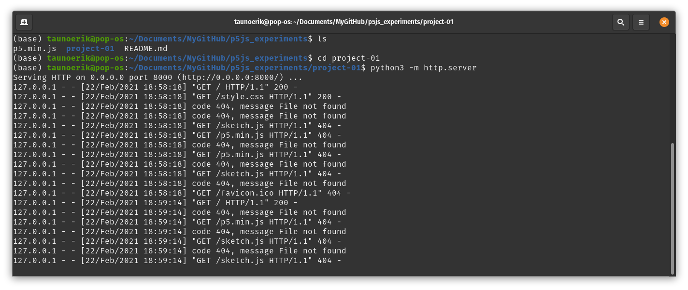
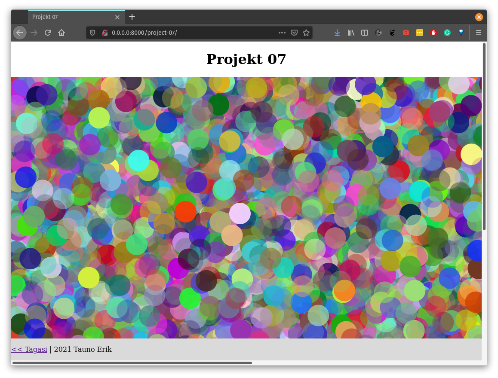

# Eksperimendid p5.js'iga

Projektide vaatamiseks brauserist: [taunoe.github.io/p5.js_experiments/](https://taunoe.github.io/p5.js_experiments/)

Lähtekood: [taunoe.github.io/p5.js_experiments/](https://taunoe.github.io/p5.js_experiments/)

## Mis on

## Kohaliku veebiserveri avamine

Projektide vaatamiseks brauseris mine: [taunoe.github.io/p5.js_experiments/](https://taunoe.github.io/p5.js_experiments/)

Projekti vaatamiseks kohalikus arvutis on kõige kiirem meetod ajutise veebiserveri tegemine. Käsuga:

    python3 -m http.server

## Õppe eksperimendid

nr | nimi | märkused
---|---|---
01 |[projekt-01](project-01/)|Tühi projekt, millest alustada. Taust, punkt, joon, ristkülik, ruut, ellips, ring, kolmnurk, nelinurk
02 |[projekt-02](project-02/)|Dünaamilised väärtused, värvid, joonejämedus
03 |[projekt-03](project-03/)|Kordused
04 |[Kosmoselaev](project-04/) |Codecademy kosmoselaeva näide
05 |[projekt-05](project-05/)|Frames, frameCount, text, animatsioon
06 |[Põrkav pall](project-06/)|Codecademy näide
07 |[Juhuslikud täpid](project-07/)|random
08 |[Ekslev pall](project-08/)|Müra, [Perlin noise](https://en.wikipedia.org/wiki/Perlin_noise), Codecademy näide
09 |[Ujuvad ringid](project-09/)|Funktsioonid
10 |[Langev täht](project-10/)|Codecademy näide
11 |[Rotate](project-11/)|Codecademy näide
11 |[Projekt-12](project-12/)|rectMode(), ellipseMode(), translate()

## Lingid

- [Codecademy: learn-p5js](https://www.codecademy.com/learn/learn-p5js)

___

Copyright 2021 Tauno Erik [taunoerik.art](https://taunoerik.art)
